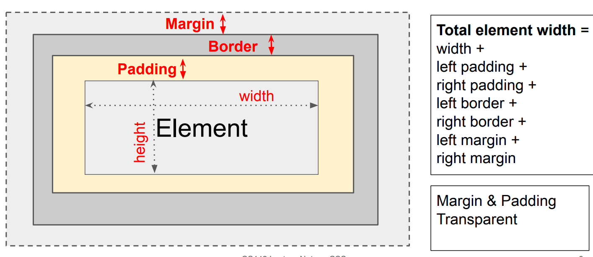

# CS142 Web Applications

- Notebook created on 2022/6/26

## 学习目标

- 学会基础的全栈式开发

## 目录

- <a href="Environment">Environment</a>

- <a href="#intro">Intro</a>
- <a href="#HTML">HTML</a>

- <a href="#CSS">CSS</a>

- <a href="#URL">URL</a>

- <a href="#JS">JavaScript</a>

- <a href="#re">Regular Expression</a>

- <a href="#events">Events</a>

- <a href="#dom">DOM</a>


## <a id="Environment">Environment</a>

HTML: VScode + Live Server(Extention)

## <a id="intro">Intro</a>

- Full stack

Browser -- Web server -- Storage system

Chrome -- Node.js -- MongoDB


## <a id="HTML">HTML</a>

Concept: HyperText **Markup Language**（超文本标记语言）

Approach:

- Start with content
- Annotate it with tags

#### Tags

Meaning of text: <h1>

Formatting information: <i>

Additional information 

#### XML

Basic Syntax rules:

- Document started with <html>
- Tags can contain attributes
- special characters
  - &lt &gt &amp...

Structure:

<?xml version="1.0" encoding="utf-8"?>

<!DOCTYPE html PUBLIC "-//W3C//DTD XHTML 1.0 Strict//EN" 

"http://www.w3.org/TR/xhtml1/DTD/xhtml1-strict.dtd">

<html xmlns="..." xml:lang="en" lang="en">

<head>

</head>

<body>

Common used tags:

- #<table> <tr> <td> Tables

- #<ul> <li> Unordered list

- #<ol> <li> Ordered list

- #<div> Grouping related elements, forces a line break before and after

- #<span> Used for single line 

- #<form> <input> <textarea> <select> Create forms to input data

---

#<head> section  

- #<title> Create title, which will appear in the title bar for the browser
- #<link> CSS stylesheets
- #<script> Javascript


## <a id="CSS">CSS</a>

Key Concept: separate style from content (#<span class="test">)

DRY principle: don't repeat yourself

Rules:

```css
(selector){
    property1: value;
    property2: value;
    ...
}
```

---

Selector:

- Tag name: h1
- Class attribute: .large
- Tag and class: p.large
- Element id #id20

- (Pseudo) hover: (p:hover) When mouse is over element
- (Pseudo) a:link, a:visited

---

Properties:

- Coloring

Predefined names: red, blue ...

8-bit hexadecimal number: #ff0000 (RGB)

0-255 decimal: rgb(255, 255, 0)

Percentage: rgb(80% 80% 80%)

---

Box model: Margin, Border, Padding, Element



Size properties:

**width, height** | **model**-**location**(top, right, bottom, left)-**properties**(color, style, width)

---

Position property:

**static**: document flow

**relative**: position related to default position via top right bottom left

**fixed**: position related to a fixed location, (0,0) means top left corner

**absolute**: related to ancestor absolute element

---

More properties:

- background-img
- background-repeat
- font, font-family, font-size, font-weight, font-style
- text-align, vertical-align:(center, left, right)

- cursor
- display:(none, inline, block, flex, grid)
- visibility:(hidden, visible)

---

Issues:

Inheritance: **Inherited**(font-size), **Others**(border,background)

Multiple rule matches:**Most specific rule wins**

---

Adding styles to HTML

- Page specific:

```html
<head>
    <style type="text/css">
        /* your CSS */
    </style>
</head>
```

- Element-specific:

```html
<a style="/* Your style */">Text</a>
```

- Seperate style sheet:

```html
<head>
    <link rel="stylesheet" type="text/css" href="/* css path */">
</head>
```

- @import


## <a id="URL">URL</a>

Uniform Resource Locators (URL)

**Parts**

protocol://hostname[:port]/path/[;params)[?query]#fragment

- Scheme (http) : identify protocal
- Host name(//dase.ecnu.edu.cn): name of the machine
- Port number(80): allow multiple server to run on the same machine
- Query parameters:(?user=Alice&year=2008)
- Fragment (#p2): have browser scroll page to fragment (browser only)

**Schemes**

http; https; file; websocket(TCP); mailto ...

**Hierarchical portion(层级)**

API design, server interpretation, program with routing infomation

**Query Parameters**

Operation(Traditional), Switch pages(Morden)

**Links**

<a href = "yourURL"(NO BLANK)>TEXT</a>

Type:

- FULL URL
- Absolute URL: /path1/file1
- Relative URL path1/file1
- anchor point(#NAME)

**Encoding**

Anything other than **A-z, 0-9, -_.~** should be represented as %xx


## <a id="JS">JavaScript</a>

- *Stanford CS193X*


`<script src="filepath"></script>`

**No main method, no compilation by developer**


**var/let/const**

var: 作用域：函数

let: 作用域：区块{}

const: 常量引用，作用域：区块，不能被重赋值，重定义

````javascript
for(var i = 0; i < length; i++)// 出循环i=length
for(let datum of data)// 出循环datum未定义
for(let property in object)
for(const datum of data)
````

const特例：

 ```js
 const list = [1, 2, 3];
 list.push(4); // OK
 ```

原则：

- 没事别用var，能写const尽量const


Primitive types:

- Boolean, Number(double), String, Symbol, Null, Undefined

- use `===` `!==`instead of ==, !=
- null is similar to `nullptr`in C++ and `null`in Java
- null is a value but undefined means the variable has not been a value


! STILL WRITING


## <a id="re">Regular Expression</a>

https://www.youtube.com/watch?v=sa-TUpSx1JA

1. `abc` `123`有顺序，大小写敏感
2. 特殊字符需要加上`\`
3. 匹配符

`.` Any character except new line

`\d` Digit(0-9)

`\D` Not a Digit

`\w` Word Character(A-z, 0-9, _)

`\W` Not a word character

`\s` Whitespace(space, teb, newline)


4. Anchors

`\b` Word Boundary ((boundary here)**Ha** (boundary here)**Ha**Ha)

`\B` Not a word boundary(Ha Ha**Ha**)

`^` Beginning of a String

`$` End of a string


5.Sets

`[]`Character sets, match only one character

- [123] matches one char equals 1 or 2 or 3

- `[a-z]`: ranges

- `[^a]`: 除了a剩下都匹配
- `|` Either or
- `(...)` Group

`M(r|s|rs)`: Mr, Ms, Mrs


6.Quantifiers`{}`

`*` 0 or more

`+` 1 or more

`?` 0 or 1

`{3}` Exact number

`{3,4}`Range of numbers {min, max}


## <a id="events">Events</a>

- Event-Driven

Code doesn't run right away, but executes after some events fires

Any function listening to events called **event handler**

- HTML elements

Buttons: <button>click me</button>

```<button>click me</button>```

Single-line text input: 

```<input type="text" />```

Multi-line text input:

`<textarea></textarea>`


## <a id="dom">DOM</a>

**D**ocument **O**bject **M**odel: HTML document exposed as a collection of JS objects and methods

- Hierachy(等级制度)

Root: `window.document`(<html>)

Structure: `window.document.head`,`window.document.body`

- Getting objects:

Choose selector first:`document.querySelector('css selector')`

Then get element: `let elem = document.querySelector('#button')`(select id="button")

- Adding event listeners

For DOM objects:`addEventListener(eventName, functionName)`

- Use defer

`<script src="script.js" defer></script>`

Execute after DOM is loaded

**DO NOT** put <script> at the bottom


